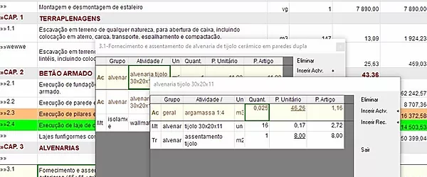
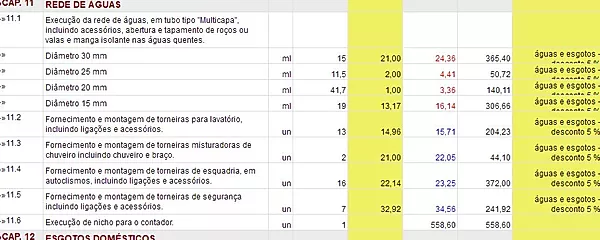
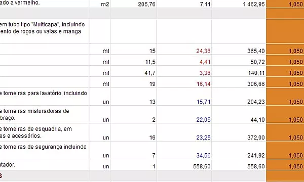

Software específico para elaboração de orçamentos orientados por produtos, utilizando a tecnologia de base de dados.

A sua funcionalidade assenta na utilização simultânea de duas bases de dados, 
a correspondente à base de dados geral da empresa, denominada de "Base de Dados" 
e a base de dados correspondente ao orçamento de trabalho, denominada de "Orçamento".

## Como Utilizar

Selecione uma base de dados que lhe sirva de partida à elaboração do seu orçamento. 
A seleção é feita unicamente no 1º arranque do programa. 
Se pretender selecionar posteriormente uma outra base de dados, vá a Ficheiros/Base de Dados/Abrir e selecione outra base de dados. 

De seguida, abra um orçamento (Ficheiros/Abrir Obra).
Abra a janela da Lista de Preços Unitários (Orçamento/Lista de Preços Unitários)

:::note
Na primeira utilização, o VisualOrc abre automaticamente o orçamento “Exemplo” e a Base de Dados “Base de Dados – Exemplo”.
:::
 
Edite e modifique os preços compostos dos artigos clicando duas vezes com o botão esquerdo do rato sobre um artigo. 
Insira novas atividades e recursos no artigo que editou. 
Alterne entre a inserção de atividades/recursos do orçamento e da base de dados.

### Introduza Preços Diretos 
Clique no botão ‘vista de preços diretos’ e introduza preços diretos na coluna amarela, reportando-os a um tipo de preço direto. 
Se pretender pode criar novos tipos de preços diretos (Orçamento/Preços Diretos).

### Introduza Margens 
Clique no botão ‘vista de margens’, selecione um ou mais artigos e introduza a margem a aplicar a cada artigo. 
Se pretender selecionar todos os artigos, clique no cabeçalho ‘margem’ e introduza a margem a aplicar a todos os artigos.

